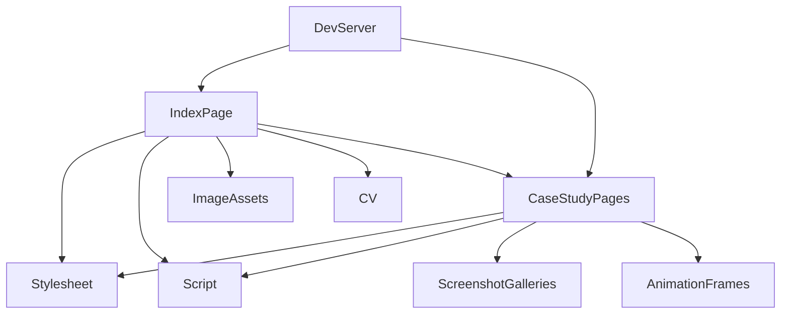

# AboutMe — Architecture

## 1. Stack
- HTML5, CSS3 (custom properties, Grid/Flexbox, `clamp()`), vanilla JavaScript (ES6+, `IntersectionObserver`, `Fetch`). (README.md)
- No framework, no build step, no dependencies, no `package.json`/`go.mod`/`pyproject.toml`/`Cargo.toml` found at repo root. (direct dir scan)
- Fonts: Fraunces, Hanken Grotesk, JetBrains Mono via Google Fonts CDN (`<link>` in index.html head). (index.html)
- `wpdev.html` alone also loads Tailwind via CDN (self-contained page). (README.md)

## 2. Directory map
| path | what lives there |
|---|---|
| index.html | Main single-page portfolio hub — About, Experience, Skills, Work, Problem-solving, Contact sections |
| ai-dev.html, pos.html, ecommerce.html, wpdev.html, automation.html, websites.html | Six standalone case-study pages, each with a unified top bar back to `index.html#work` |
| css/style.css | Shared stylesheet — design tokens (`:root`) + all shared components |
| js/script.js | Active-nav highlight, mobile menu, live competitive-programming stats |
| images/ | Site images, `favicon.svg`; images/pos/ holds POS screenshots (admin/manager/cashier) |
| MegaBazar/ | E-commerce case-study screenshots (used by ecommerce.html) |
| parmacyShop/ | Pharmacy POS case-study screenshots (used by pos.html) |
| Animation/ | 52-frame PNG sequence painted to canvas by wpdev.html |
| Siam-Hossain-CV.pdf | CV — linked from header, hero, and contact CTAs |
| .claude/ | server.mjs (local static dev server, port 8765) + launch.json |
| README.md | Project documentation |

## 3. Diagram

## 4. Component index
- [[IndexPage]]
- [[CaseStudyPages]]
- [[Stylesheet]]
- [[Script]]
- [[ImageAssets]]
- [[CV]]
- [[ScreenshotGalleries]]
- [[AnimationFrames]]
- [[DevServer]]

## 5. Entry points
- **Dev:** `node .claude/server.mjs` → `http://127.0.0.1:8765` (or any static server, e.g. `python3 -m http.server 8765`; opening `index.html` directly also works but breaks live-stats fetches). (README.md)
- **Prod:** static hosting of the repo root — live at `https://alphaman-0.github.io/AboutMe/` via GitHub Pages, no build/config step. (README.md)

## 6. Conventions (observed)
- Case-study pages are flat files at REPO_ROOT named after the project (`ai-dev.html`, `pos.html`, `ecommerce.html`, `wpdev.html`, `automation.html`, `websites.html`), not nested in a subfolder. (dir scan)
- Screenshot sets for a case study live in their own top-level folder named after the project (`MegaBazar/`, `parmacyShop/`), separate from the shared `images/` folder. (dir scan)
- Shared design tokens and components live in `css/style.css`; page-specific visual work is added as an inline `<style>` block in that page rather than edited into the shared stylesheet — index.html's own header comment states the enhancement styles are "PAGE-SCOPED ... index.html only" and that `css/style.css` is "intentionally left untouched." (index.html)
- Live external-data fetches (competitive-programming stats in index.html) use `Promise.allSettled` with per-fetch `AbortController` timeouts, and always keep a hardcoded fallback value in the HTML markup itself (e.g. `303`) so the UI never breaks if a fetch fails. (index.html, README.md)
- Section anchors (`#about`, `#experience`, `#skills`, `#work`, `#solving`, `#contact`) are the join between the nav (`#site-nav`) and `js/script.js`'s `IntersectionObserver`-driven active-nav highlight. (index.html)

## 7. Where things go
- **Add a new case-study project:** create `<name>.html` at REPO_ROOT, add its screenshot set as a new top-level folder (pattern: `MegaBazar/`, `parmacyShop/`) or under `images/`, then add a `<a class="work-card">` entry linking to it inside `index.html`'s `#work` section, loading `css/style.css` + `js/script.js` per the existing case-study pages.
- **Change site-wide visual tokens (color/type/spacing):** edit the `:root` design tokens in `css/style.css` — affects every page except `wpdev.html` (self-contained). (README.md)
- **Add/rename a top-level nav section on the hub page:** update both the `<nav id="site-nav">` links and the matching `<section id="...">` in `index.html`, since `js/script.js`'s active-nav highlight keys off those section ids.
- **Update the live problem-solving stats or their fallback numbers:** edit the hardcoded `` values in `index.html` and, if the data source changes, the fetch logic in `js/script.js`. (index.html, README.md)
- **Change local dev server behavior:** edit `.claude/server.mjs` (Node static file server, path-traversal guarded, port 8765). (README.md — file itself not read, out of scope for this pass)
